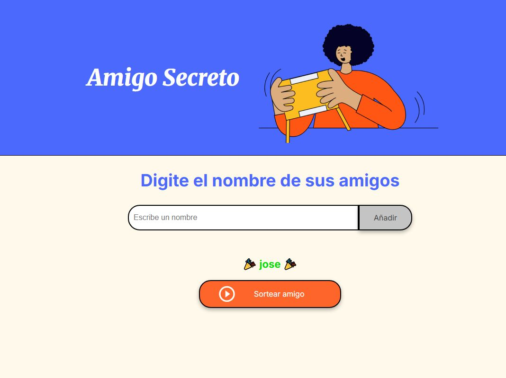

# Practicando Lógica de Programación: Challenge Amigo secreto

### Instrucciones del Juego
El desafío consiste en un juego interactivo web en el cual el usuario deberá ingresar una serie de nombres "amigos" y luego de una cierta cantidad de ingresos podrá sortear el “amigo secreto”.
A continuación, se detalla la forma de uso del juego, se utilizará la *figura 1* con los números que se observan en ella para señalar determinadas partes como referencia para poder desarrollar la explicación.

*figura 1*

- 1: Campo de texto para ingresar los “Amigos”
- 2: Una vez ingresado el “Amigo” debe hacer clic en el botón señalado “Añadir”
- 3: Lugo de ingresar los “Amigos” deseados presione el botón “Sortear amigo” que se encuentra señalado en este punto.

Los “amigos” que se van añadiendo se van a ir mostrando debajo del campo de texto ver *figura 2*.

*figura 2*

 y cuando se realice el sorteo va aparecer en lugar de esa lista como se muestra en la *figura 3*

*figura 3*